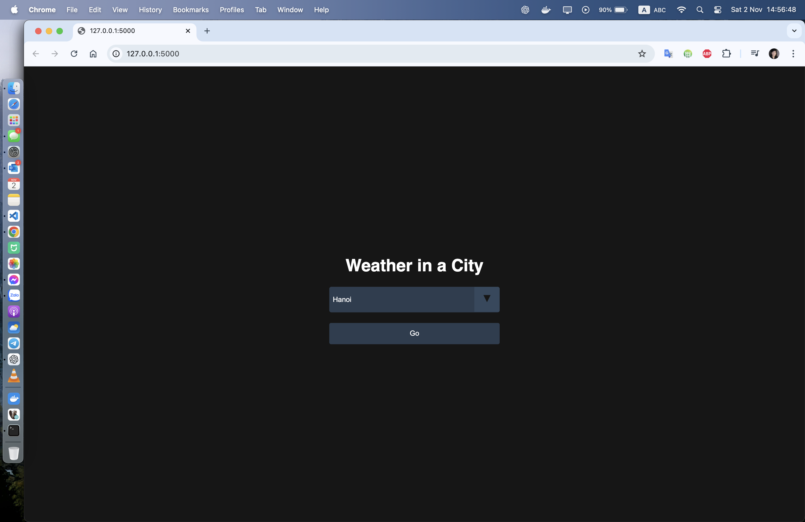
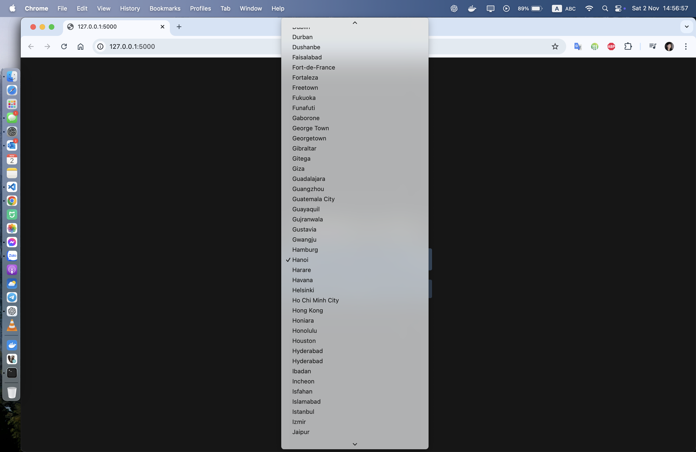
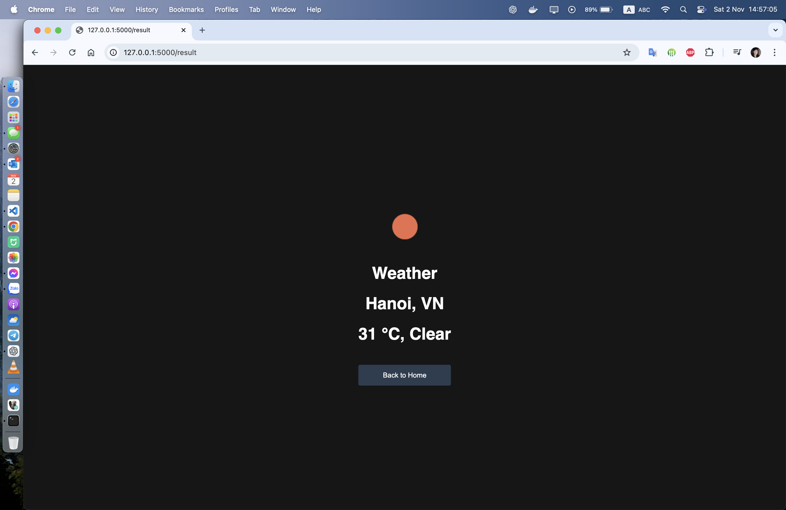

# weather-app
Một web app đơn giản, sử dụng flask framework
Xem thời tiết ở một thành phố nào đó trên thế giới

Liên kết api của bên openweathermap.org để lấy thông tin thời tiết của một thành phố trong danh sách cho trước
Sau đó hiển thị thông tin thu được ra màn hình kết quả

# Các bước để chạy được dự án
1. Dùng pip cài các thư viện cần thiết: pip install -r requirements.txt
2. Tạo API Key trên openweathermap để sử dụng (có key này mới có quyền sử dụng api)
 Vào trang sau để tạo api key: https://home.openweathermap.org/api_keys
3. Thêm biến trong file env
 Thêm biến API_KEY và điền giá trị key đã tạo trong bước 2
4. Chạy dự án
 Dùng lệnh python main.py
5. Dùng dự án
 Dùng tổ hợp phím ctrl+c, hoặc kill terminal

# Demo

